STA380 - Exercise02
================
Saswata Das, Anurag Agarwal, Sidhaarthan Velur Gopalakrishnan & Siddhant Shah
18 August 2017

### Part A

There are 3 dimensions that we have tried to analyse in the data:

-   Delay by Flight Distance
-   Delay by Time Periods
-   Delay by Type of Delay

------------------------------------------------------------------------

#### 1. Delay by Flight Distance:

For this, we have looked at which flights from which airports tend to be delayed at Austin. Below are the top 10 airports with most number of delayed flights to Austin in 2008:

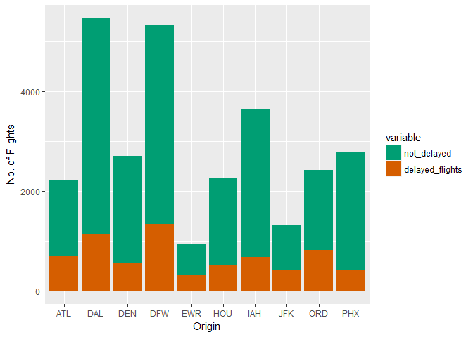

From this, it can be observed that both Dallas airports and Houston seem to be in the top 3. However, the proportion of delayed flights to total number of flights for these airports is not as large as for Orlando and Atlanta.

This can be further validated by looking at delayed flights by distance, where flights are grouped into the following threee categories:

-   Short haul : Less than 500 miles
-   Medium haul : &gt;500 but &lt;1000 miles
-   Long haul: &gt;1000 miles

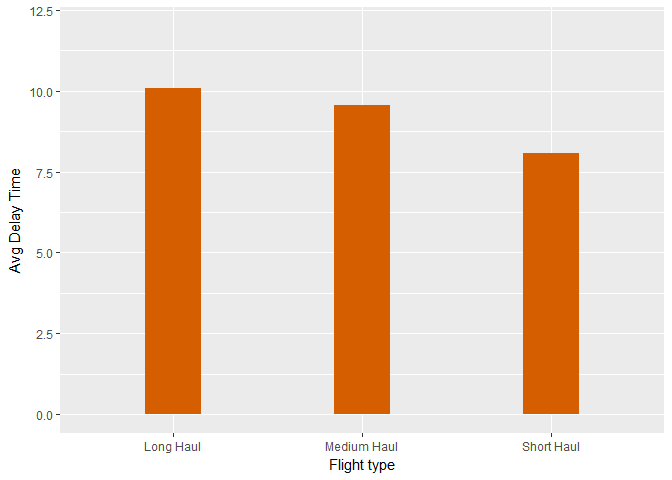

**This shows that short haul flights show lower delay times even if they are a lot more in number.**

------------------------------------------------------------------------

##### 2. Delay by Time Period:

Let's now look at different time related variations of the delay time.

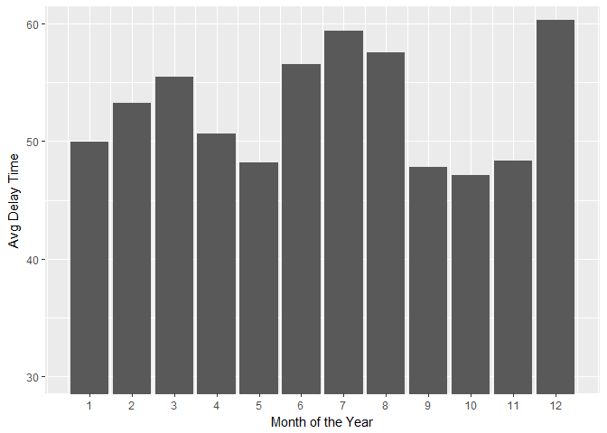

**Delays are longest in the months of June, July, August and December. These tend to be holiday periods (summer and christmas) when the passengers and air traffic is highest.**

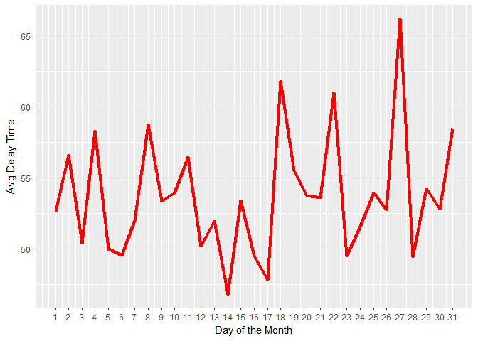

There are specific days during the month where there are peaks in terms of delay time. **Usually mid-month tends to be the best time to travel since there are lesser delays and avoiding end of the month.**

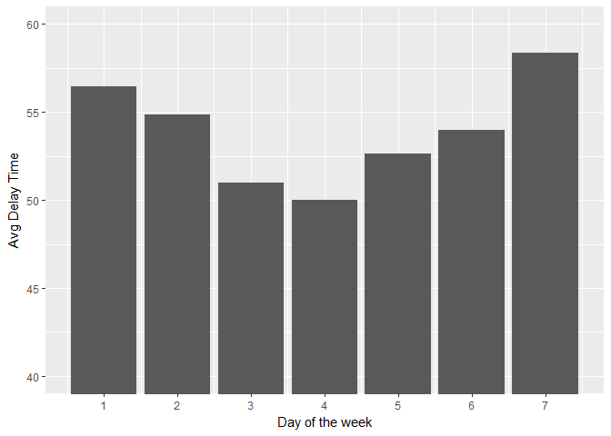

**As expected, weekends tend to have longer delays when compared to the rest of the week.**

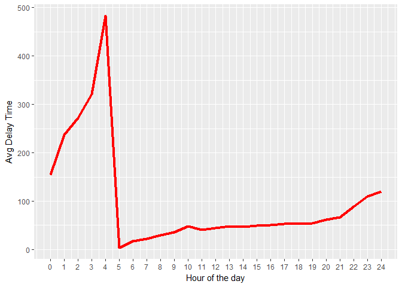

**Flights between 8PM and 4AM tend to have longer delays possibly due to reduced traffic and airport related issues.**

We try to validate this by looking at the type of delay caused across different times during the day.

------------------------------------------------------------------------

#### 3.Delay by Type of Delay

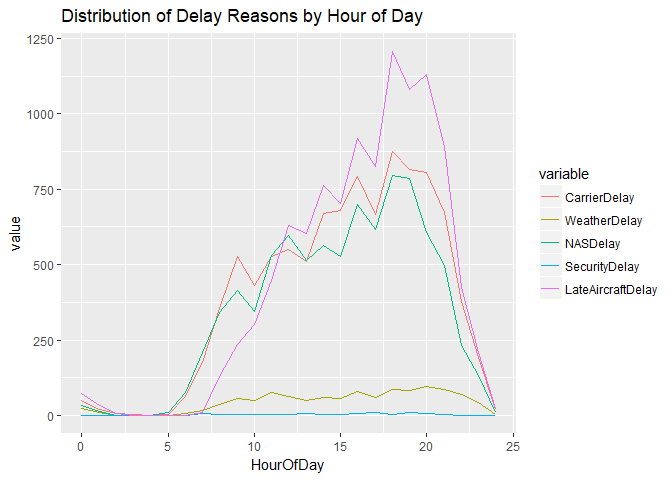

**This shows that in periods of longest delays i.e. post 8PM, carrier and NAS related issues contribute to these delays.**

Let's finally look at how carriers rank in terms of departure and arrival delays:

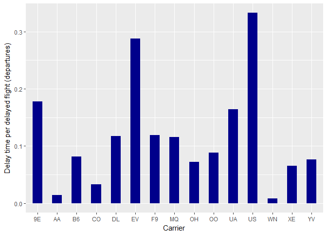

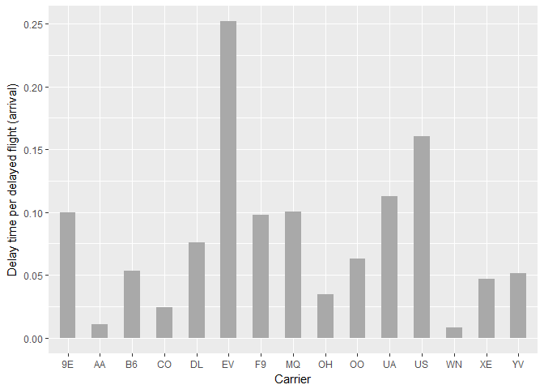

**From both of the above charts, we observe that the delay time per flight is highest for US Air (US), Atlantic Southeast Airlines (EV) and Pinnacle Airlines (9E) carriers for flights flying in and out of Austin airport.**

------------------------------------------------------------------------

### Part B: AUTHOR ATTRITBUTION

For this problem, we have built two different models. Both are Naive Bayes models, but the difference is in the way their Document Term Matrix has been constructed -

DTM for Model 1 -

-   Weighting : Term Frequency

DTM for Model 2 -

-   Weighting : Term Frequency - Inverse Term Frequency

Load libraries

``` r
library(tm) 
```

    ## Loading required package: NLP

    ## 
    ## Attaching package: 'NLP'

    ## The following object is masked from 'package:ggplot2':
    ## 
    ##     annotate

``` r
library(magrittr)
library(class)
library(caret)
```

    ## 
    ## Attaching package: 'caret'

    ## The following object is masked from 'package:survival':
    ## 
    ##     cluster

``` r
library(e1071)
```

    ## 
    ## Attaching package: 'e1071'

    ## The following object is masked from 'package:Hmisc':
    ## 
    ##     impute

``` r
#Wrapper function
readerPlain = function(fname){
  readPlain(elem=list(content=readLines(fname)), id=fname, language='en') }
```

Read files from directory -

``` r
train = "E:/Siddhant/UT Austin/Coursework/Summer/Intro to Predictive Modelling/Part 2 - James Scott/STA380/data/ReutersC50/C50train"
test = "E:/Siddhant/UT Austin/Coursework/Summer/Intro to Predictive Modelling/Part 2 - James Scott/STA380/data/ReutersC50/C50test/"
file_list = Sys.glob(paste0(train,'/*/*.txt'))
file_list_test = Sys.glob(paste0(test,'/*/*.txt'))
authornames = list.dirs("E:/Siddhant/UT Austin/Coursework/Summer/Intro to Predictive Modelling/Part 2 - James Scott/STA380/data/ReutersC50/C50train", full.names = FALSE)[-1]

classificationnames = rep(authornames, each=50)
authors = lapply(file_list, readerPlain) 
authors_test = lapply(file_list_test,readerPlain)

mynames = file_list %>%
{ strsplit(., '/', fixed=TRUE) } %>%
{ lapply(., tail, n=2) } %>%
{ lapply(., paste0, collapse = '') } %>%
  unlist
```

Create Corpus for train and test documents -

``` r
names(authors) = mynames
my_documents = Corpus(VectorSource(authors))

mynamestest = file_list_test %>%
{ strsplit(., '/', fixed=TRUE) } %>%
{ lapply(., tail, n=2) } %>%
{ lapply(., paste0, collapse = '') } %>%
  unlist

names(authors_test) = mynamestest
my_documents_test = Corpus(VectorSource(authors_test))
```

Data Processing

``` r
#Train Corpus
my_documents = tm_map(my_documents, content_transformer(tolower)) # make everything lowercase
my_documents = tm_map(my_documents, content_transformer(removeNumbers)) # remove numbers
my_documents = tm_map(my_documents, content_transformer(removePunctuation)) # remove punctuation
my_documents = tm_map(my_documents, content_transformer(stripWhitespace)) ## remove excess white-space
my_documents = tm_map(my_documents, content_transformer(removeWords), stopwords("en"))
my_documents <- tm_map(my_documents, removeWords, c("character"))
#Test Corpus
my_documents_test = tm_map(my_documents_test, content_transformer(tolower)) # make everything lowercase
my_documents_test = tm_map(my_documents_test, content_transformer(removeNumbers)) # remove numbers
my_documents_test = tm_map(my_documents_test, content_transformer(removePunctuation)) # remove punctuation
my_documents_test = tm_map(my_documents_test, content_transformer(stripWhitespace)) ## remove excess white-space
my_documents_test = tm_map(my_documents_test, content_transformer(removeWords), stopwords("en"))
my_documents_test <- tm_map(my_documents_test, removeWords, c("character"))
```

Create Document Term Matrix. Then treat for sparsity as follows -

-   TF : 95%
-   TF-IDF : 99%

``` r
## Model 1 : DTM_TF 
DTM_tf = DocumentTermMatrix(my_documents)
DTM_tf = removeSparseTerms(DTM_tf, 0.95) #remove words that are not present in more than 95% articles
DTM_tf_test = DocumentTermMatrix(my_documents_test)
DTM_tf_test = removeSparseTerms(DTM_tf_test, 0.95)

## Model 2 : DTM_TF_IDF
DTM_tf_idf = DocumentTermMatrix(my_documents, control = list(weighting = function(x) weightTfIdf(x, normalize = FALSE)))
DTM_tf_idf = removeSparseTerms(DTM_tf_idf, 0.99)
DTM_tf_idf_test = DocumentTermMatrix(my_documents_test, control = list(weighting = function(x) weightTfIdf(x, normalize = FALSE)))
DTM_tf_idf_test = removeSparseTerms(DTM_tf_idf_test, 0.99)
```

Create Dense Matrix and Normalize word frequency

``` r
#Train matrix for model 1 and model 2
X.m1 = as.matrix(DTM_tf)
X.m1 = X.m1/rowSums(X.m1)  # term-frequency weighting
X.m2 = as.matrix(DTM_tf_idf)
X.m2 = X.m2/rowSums(X.m2)
#Test matrix for model 1 and model 2
X.m1_test = as.matrix(DTM_tf_test)
X.m1_test = X.m1_test/rowSums(X.m1_test)
X.m2_test = as.matrix(DTM_tf_idf_test)
X.m2_test = X.m2_test/rowSums(X.m2_test)

#Convert matrix to dataframe
mat_tf.df <- as.data.frame(X.m1, stringsAsfactors = FALSE)
mat_tf.df$categorynb <- as.factor(classificationnames)

mat_tf_test.df <- as.data.frame(X.m1_test, stringsAsfactors = FALSE)
mat_tf_test.df$categorynb <- as.factor(classificationnames)

mat_tf_idf.df <- as.data.frame(X.m2, stringsAsfactors = FALSE)
mat_tf_idf.df$categorynb <- as.factor(classificationnames)

mat_tf_idf_test.df <- as.data.frame(X.m2_test, stringsAsfactors = FALSE)
mat_tf_idf_test.df$categorynb <- as.factor(classificationnames)
```

Set up the models -

``` r
#Model 1: TF
model_tf <- naiveBayes(categorynb ~ ., data = mat_tf.df, laplace = 1)
#Model 2 : TF-IDF
model_tf_idf <- naiveBayes(categorynb ~ ., data = mat_tf_idf.df, laplace = 1)

#Model 1 against test data
preds_tf <- predict(model_tf, newdata = mat_tf_test.df)
conf.mat.tf <- confusionMatrix(preds_tf, mat_tf_test.df$categorynb)
conf.mat.tf$overall['Accuracy']
```

    ## Accuracy 
    ##   0.4928

``` r
#Model 2 against test data
preds_tf_idf <- predict(model_tf_idf, newdata = mat_tf_idf_test.df)
conf.mat.tf_idf <- confusionMatrix(preds_tf_idf, mat_tf_idf_test.df$categorynb)
conf.mat.tf_idf$overall['Accuracy']
```

    ## Accuracy 
    ##   0.5668

-   Accuracy for Model 1 (TF) : 49%
-   Accuracy for Model 1 (TF-IDF) : 57%

Both models are able to classify about half of the articles with their correct authors. But TF-IDF gives slightly higher accuracy than TF. It is probably because TF-IDF accounts for words that have not occured very frequently.

However, the disadvantage of using TF-IDF is that we need to keep higher number of words in our document term matrix which increases the time it takes to run the model.

------------------------------------------------------------------------

### Part C

#### Reading in the text file and wrangling to obtain the file

-   Initially the file is present in a .txt file as comma separated values.
-   Since the number of items in each transaction, we used 50 as the maximum number of items and filled the ones without values with NA
-   The columns which have NAs completely were removed
-   Another column called User ID is created
-   The data is then reshaped to have both the User Id and the value along the rows
-   The values which are blank are then removed from the data
-   The unnecessary columns from the data are removed
-   The USER ID is then converted into a factor
-   Convert the data into a format that the **Apriori** algorithm accepts

``` r
#Reading the text file into R with 50 columns because we do not know he maximum number of items in a basket

setwd("E:/Siddhant/UT Austin/Coursework/Summer/Intro to Predictive Modelling/Part 2 - James Scott/STA380/data")

grocery_basket <- read.table("groceries.txt", header = FALSE, sep = ",", col.names = paste0("V",seq_len(50)), fill = TRUE)

#Removing the columns with NA values
grocery_basket = grocery_basket[colSums(!is.na(grocery_basket)) > 0]

#Creating a User ID column
grocery_basket$User_ID <- seq.int(nrow(grocery_basket))

#Melting data to get it into required format
grocery_analysis = melt(grocery_basket,id=c("User_ID"))

#Removing the column name
grocery_analysis = grocery_analysis[,-c(2)]

#Sorting the items by ID
grocery_analysis_2 = grocery_analysis[order(grocery_analysis$User_ID),]

#Removing rows with missing values
grocery_analysis_3 = grocery_analysis_2[grocery_analysis_2$value != "",]

#Summary statistics
str(grocery_analysis_3)
```

    ## 'data.frame':    43367 obs. of  2 variables:
    ##  $ User_ID: int  1 1 1 1 2 2 2 3 4 4 ...
    ##  $ value  : Factor w/ 170 levels "abrasive cleaner",..: 29 126 87 166 147 157 33 156 108 157 ...

``` r
summary(grocery_analysis_3)
```

    ##     User_ID                  value      
    ##  Min.   :   1   whole milk      : 2513  
    ##  1st Qu.:2456   other vegetables: 1903  
    ##  Median :4828   rolls/buns      : 1809  
    ##  Mean   :4909   soda            : 1715  
    ##  3rd Qu.:7380   yogurt          : 1372  
    ##  Max.   :9835   bottled water   : 1087  
    ##                 (Other)         :32968

``` r
#Turn User_ID into a factor
grocery_analysis_3$User_ID = as.factor(grocery_analysis_3$User_ID)

# First split data into a list of items for each person
gorcery_data <- split(x=grocery_analysis_3$value, f=grocery_analysis_3$User_ID)

## Remove duplicates ("de-dupe")
unique_grocery <- lapply(gorcery_data, unique)

## Cast this variable as a special arules "transactions" class.
groctrans <- as(unique_grocery, "transactions")
```

#### Loop through different values of support and confidence

-   Assign different values to support and confidence
-   Loop through and obtain the maximum lift for different combinations of support and confidence
-   Run through **Apriori** algorithm

``` r
#Now run the 'apriori' algorithm for different combinations of minsup and minconf

sup= c(0.01,    0.015,  0.02,   0.025,  0.03,   0.035,  0.04,   0.045,  0.05)
conf=c(0.3, 0.35,   0.4,    0.45,   0.5,    0.55,   0.6,    0.65,   0.7,    0.75)

supnew=c()
confnew=c()
lift=c()

for (i in sup){
  for (j in conf){
    grocery_rules <- apriori(groctrans, 
                             parameter=list(support=i, confidence=j, maxlen=10))
    df = as(grocery_rules, "data.frame")
    supnew=c(supnew,i)
    confnew=c(confnew,j)
    lift=c(lift,max(df$lift))
  }
}
fin = do.call(rbind, Map(data.frame, minsup=supnew, minconf=confnew, maxlift=lift))
```

### Exploring the best combination of Support-Lift-Confidence

-   By looking through the different combinations of Support-Confidence, select the best combination

``` r
fin
```

    ##    minsup minconf  maxlift
    ## 1   0.010    0.30 3.295045
    ## 2   0.010    0.35 3.295045
    ## 3   0.010    0.40 3.029608
    ## 4   0.010    0.45 3.029608
    ## 5   0.010    0.50 3.029608
    ## 6   0.010    0.55 3.029608
    ## 7   0.010    0.60     -Inf
    ## 8   0.010    0.65     -Inf
    ## 9   0.010    0.70     -Inf
    ## 10  0.010    0.75     -Inf
    ## 11  0.015    0.30 3.040367
    ## 12  0.015    0.35 2.567516
    ## 13  0.015    0.40 2.449770
    ## 14  0.015    0.45 2.449770
    ## 15  0.015    0.50 2.024770
    ## 16  0.015    0.55     -Inf
    ## 17  0.015    0.60     -Inf
    ## 18  0.015    0.65     -Inf
    ## 19  0.015    0.70     -Inf
    ## 20  0.015    0.75     -Inf
    ## 21  0.020    0.30 2.842082
    ## 22  0.020    0.35 2.449770
    ## 23  0.020    0.40 2.449770
    ## 24  0.020    0.45 2.449770
    ## 25  0.020    0.50 2.007235
    ## 26  0.020    0.55     -Inf
    ## 27  0.020    0.60     -Inf
    ## 28  0.020    0.65     -Inf
    ## 29  0.020    0.70     -Inf
    ## 30  0.020    0.75     -Inf
    ## 31  0.025    0.30 2.246605
    ## 32  0.025    0.35 2.246605
    ## 33  0.025    0.40 2.246605
    ## 34  0.025    0.45 1.946053
    ## 35  0.025    0.50     -Inf
    ## 36  0.025    0.55     -Inf
    ## 37  0.025    0.60     -Inf
    ## 38  0.025    0.65     -Inf
    ## 39  0.025    0.70     -Inf
    ## 40  0.025    0.75     -Inf
    ## 41  0.030    0.30 2.246605
    ## 42  0.030    0.35 2.246605
    ## 43  0.030    0.40 2.246605
    ## 44  0.030    0.45     -Inf
    ## 45  0.030    0.50     -Inf
    ## 46  0.030    0.55     -Inf
    ## 47  0.030    0.60     -Inf
    ## 48  0.030    0.65     -Inf
    ## 49  0.030    0.70     -Inf
    ## 50  0.030    0.75     -Inf
    ## 51  0.035    0.30 2.246605
    ## 52  0.035    0.35 2.246605
    ## 53  0.035    0.40 2.246605
    ## 54  0.035    0.45     -Inf
    ## 55  0.035    0.50     -Inf
    ## 56  0.035    0.55     -Inf
    ## 57  0.035    0.60     -Inf
    ## 58  0.035    0.65     -Inf
    ## 59  0.035    0.70     -Inf
    ## 60  0.035    0.75     -Inf
    ## 61  0.040    0.30 2.246605
    ## 62  0.040    0.35 2.246605
    ## 63  0.040    0.40 2.246605
    ## 64  0.040    0.45     -Inf
    ## 65  0.040    0.50     -Inf
    ## 66  0.040    0.55     -Inf
    ## 67  0.040    0.60     -Inf
    ## 68  0.040    0.65     -Inf
    ## 69  0.040    0.70     -Inf
    ## 70  0.040    0.75     -Inf
    ## 71  0.045    0.30 2.246605
    ## 72  0.045    0.35 2.246605
    ## 73  0.045    0.40 2.246605
    ## 74  0.045    0.45     -Inf
    ## 75  0.045    0.50     -Inf
    ## 76  0.045    0.55     -Inf
    ## 77  0.045    0.60     -Inf
    ## 78  0.045    0.65     -Inf
    ## 79  0.045    0.70     -Inf
    ## 80  0.045    0.75     -Inf
    ## 81  0.050    0.30 1.571735
    ## 82  0.050    0.35 1.571735
    ## 83  0.050    0.40 1.571735
    ## 84  0.050    0.45     -Inf
    ## 85  0.050    0.50     -Inf
    ## 86  0.050    0.55     -Inf
    ## 87  0.050    0.60     -Inf
    ## 88  0.050    0.65     -Inf
    ## 89  0.050    0.70     -Inf
    ## 90  0.050    0.75     -Inf

The best combination of Support and Confidence was found to be 0.01 and 0.35 respectively with a maximum length of 10

### Selecting the best combination

``` r
grocery_rules <- apriori(groctrans, 
                         parameter=list(support=0.01, confidence=0.35, maxlen=10))
```

    ## Apriori
    ## 
    ## Parameter specification:
    ##  confidence minval smax arem  aval originalSupport maxtime support minlen
    ##        0.35    0.1    1 none FALSE            TRUE       5    0.01      1
    ##  maxlen target   ext
    ##      10  rules FALSE
    ## 
    ## Algorithmic control:
    ##  filter tree heap memopt load sort verbose
    ##     0.1 TRUE TRUE  FALSE TRUE    2    TRUE
    ## 
    ## Absolute minimum support count: 98 
    ## 
    ## set item appearances ...[0 item(s)] done [0.00s].
    ## set transactions ...[169 item(s), 9835 transaction(s)] done [0.00s].
    ## sorting and recoding items ... [88 item(s)] done [0.00s].
    ## creating transaction tree ... done [0.00s].
    ## checking subsets of size 1 2 3 4 done [0.00s].
    ## writing ... [89 rule(s)] done [0.00s].
    ## creating S4 object  ... done [0.00s].

``` r
top = sort((subset(grocery_rules, subset=lift > 2)),by="lift")
inspect(top)
```

    ##      lhs                        rhs                   support confidence     lift
    ## [1]  {citrus fruit,                                                              
    ##       other vegetables}      => {root vegetables}  0.01037112  0.3591549 3.295045
    ## [2]  {citrus fruit,                                                              
    ##       root vegetables}       => {other vegetables} 0.01037112  0.5862069 3.029608
    ## [3]  {root vegetables,                                                           
    ##       tropical fruit}        => {other vegetables} 0.01230300  0.5845411 3.020999
    ## [4]  {curd,                                                                      
    ##       whole milk}            => {yogurt}           0.01006609  0.3852140 2.761356
    ## [5]  {rolls/buns,                                                                
    ##       root vegetables}       => {other vegetables} 0.01220132  0.5020921 2.594890
    ## [6]  {root vegetables,                                                           
    ##       yogurt}                => {other vegetables} 0.01291307  0.5000000 2.584078
    ## [7]  {tropical fruit,                                                            
    ##       whole milk}            => {yogurt}           0.01514997  0.3581731 2.567516
    ## [8]  {whipped/sour cream,                                                        
    ##       yogurt}                => {other vegetables} 0.01016777  0.4901961 2.533410
    ## [9]  {other vegetables,                                                          
    ##       whipped/sour cream}    => {yogurt}           0.01016777  0.3521127 2.524073
    ## [10] {root vegetables,                                                           
    ##       whole milk}            => {other vegetables} 0.02318251  0.4740125 2.449770
    ## [11] {onions}                => {other vegetables} 0.01423488  0.4590164 2.372268
    ## [12] {pork,                                                                      
    ##       whole milk}            => {other vegetables} 0.01016777  0.4587156 2.370714
    ## [13] {whipped/sour cream,                                                        
    ##       whole milk}            => {other vegetables} 0.01464159  0.4542587 2.347679
    ## [14] {pip fruit,                                                                 
    ##       whole milk}            => {other vegetables} 0.01352313  0.4493243 2.322178
    ## [15] {curd,                                                                      
    ##       yogurt}                => {whole milk}       0.01006609  0.5823529 2.279125
    ## [16] {root vegetables}       => {other vegetables} 0.04738180  0.4347015 2.246605
    ## [17] {butter,                                                                    
    ##       other vegetables}      => {whole milk}       0.01148958  0.5736041 2.244885
    ## [18] {root vegetables,                                                           
    ##       tropical fruit}        => {whole milk}       0.01199797  0.5700483 2.230969
    ## [19] {citrus fruit,                                                              
    ##       whole milk}            => {other vegetables} 0.01301474  0.4266667 2.205080
    ## [20] {root vegetables,                                                           
    ##       yogurt}                => {whole milk}       0.01453991  0.5629921 2.203354
    ## [21] {tropical fruit,                                                            
    ##       yogurt}                => {other vegetables} 0.01230300  0.4201389 2.171343
    ## [22] {domestic eggs,                                                             
    ##       other vegetables}      => {whole milk}       0.01230300  0.5525114 2.162336
    ## [23] {chicken}               => {other vegetables} 0.01789527  0.4170616 2.155439
    ## [24] {butter,                                                                    
    ##       whole milk}            => {other vegetables} 0.01148958  0.4169742 2.154987
    ## [25] {hamburger meat}        => {other vegetables} 0.01382816  0.4159021 2.149447
    ## [26] {domestic eggs,                                                             
    ##       whole milk}            => {other vegetables} 0.01230300  0.4101695 2.119820
    ## [27] {tropical fruit,                                                            
    ##       whole milk}            => {other vegetables} 0.01708185  0.4038462 2.087140
    ## [28] {whipped/sour cream}    => {other vegetables} 0.02887646  0.4028369 2.081924
    ## [29] {whole milk,                                                                
    ##       yogurt}                => {other vegetables} 0.02226741  0.3974592 2.054131
    ## [30] {whipped/sour cream,                                                        
    ##       yogurt}                => {whole milk}       0.01087951  0.5245098 2.052747
    ## [31] {rolls/buns,                                                                
    ##       root vegetables}       => {whole milk}       0.01270971  0.5230126 2.046888
    ## [32] {fruit/vegetable juice,                                                     
    ##       whole milk}            => {other vegetables} 0.01047280  0.3931298 2.031756
    ## [33] {other vegetables,                                                          
    ##       pip fruit}             => {whole milk}       0.01352313  0.5175097 2.025351
    ## [34] {tropical fruit,                                                            
    ##       yogurt}                => {whole milk}       0.01514997  0.5173611 2.024770
    ## [35] {other vegetables,                                                          
    ##       yogurt}                => {whole milk}       0.02226741  0.5128806 2.007235

The associations which were selected were the ones with a Lift &gt; 2. When the data is sorted and inspected, we find that most of the items in the basket are related to customers buying Root Vegetables, Other Vegetables, Yogurt and Whole Milk

``` r
plot(grocery_rules)
```

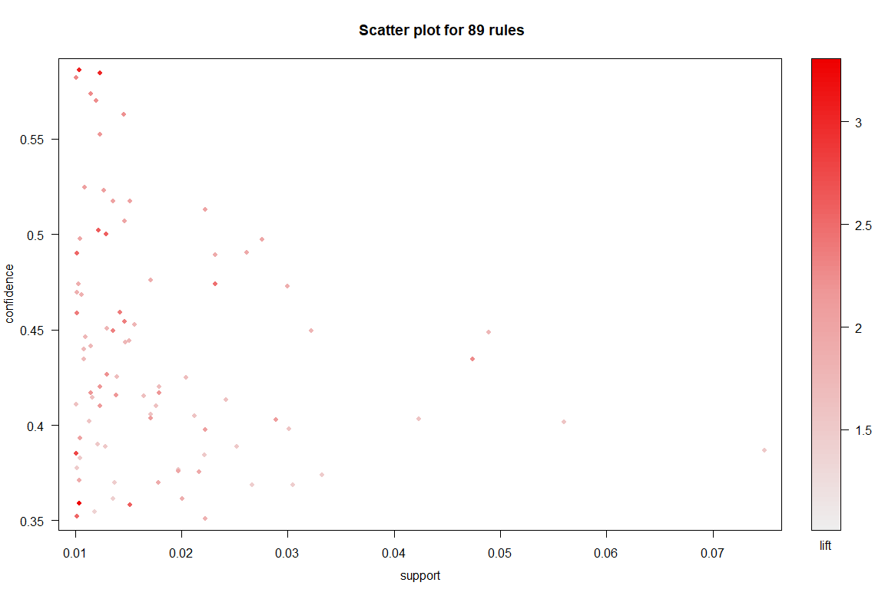

``` r
plot(top,method="grouped")
```

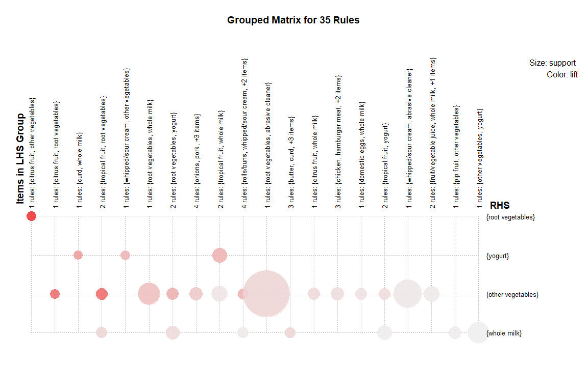

``` r
plot(top,method="graph", control = list(type="items"))
```

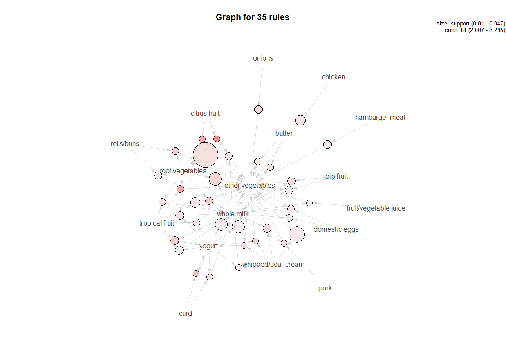

``` r
plot(top,method="paracoord", control = list(reorder=FALSE))
```

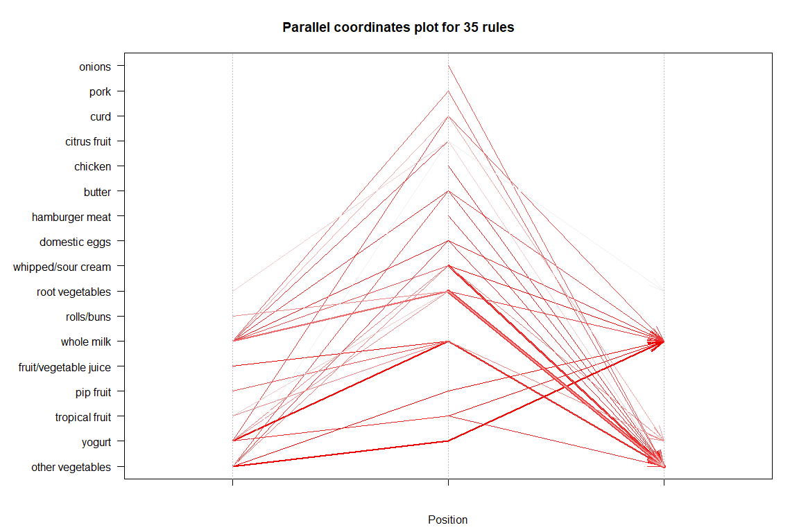

The scatter plot has support on the x-axis and confidence on the y-axis. It is seen that higher values of confidence seem to exist for lower values of suppoort. But there are a few points which have higher values of support and confidence. Provided they have enough assoications, they make for good values of support and confidence.

The different plots give us an intuitive sense of the items on the basket which lead them to buying the item. The graphs help visualize the the associations between the items.

The graph chart denotes the value of support through the size of the bubble, while the color intensity gives the value of lift.

Similarly the parallel co-ordinates plot tell us the items on the left side which lead to us buying root vegetables, yogurt, other vegetables and whole milk, using lines and intensity of the color to represent the lift.
